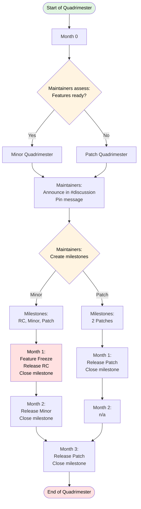

# Pycord Release Schedule

Status: Draft Authors: <Paillat-dev paillat@pycord.dev>

## Purpose & Prior Precedent

This document aims at describing the release schedule of Pycord, and its versioning.

Prior to this proposal, the Pycord release schedule was non-standard, and therefore
highly dependent on maintainer feedback and emotion towards a release.

While this approach has been deemed flexible, it has also made it complicated for users
to plan their projects around Pycord's updates, and has ultimately led to significantly
undesirable gaps between minor releases (e.g. 1y+ between v2.6.1 and v2.7.0, and between
v2.4.1 and v2.5.0).

## Release Guarantees

> [!NOTE] For an up to date list of Pycord's release guarantees, please visit
> https://docs.pycord.dev/en/stable/version_guarantees.html.

The library follows the [semantic versioning principle](https://semver.org/) which means
that the major version is updated every time there is an incompatible API change.
However, due to the lack of guarantees on the Discord side when it comes to breaking
changes along with the fairly dynamic nature of Python it can be hard to discern what
can be considered a breaking change and what isn't.

The first thing to keep in mind is that breaking changes only apply to **publicly
documented functions and classes**. If it's not listed in the documentation here then it
is not part of the public API and is thus bound to change. This includes attributes that
start with an underscore or functions without an underscore that are not documented.

## Release Schedule

This document dictates that Pycord will have the following releases every year:

- Up to three minor releases per year.
- At least three patch releases per year.
- At least one release candidate preceding each minor release by at least one month,
  with an optional second release candidate no later than two weeks before the minor
  release.
- At least one patch release one month after each minor release.

The content of releases follows semantic versioning. The release schedule follows a
quadrimestrial cycle.

At the beginning of each quadrimester, if new features are ready for release, the
**Minor Quadrimester Plan** is followed. Otherwise, the **Patch Quadrimester Plan** is
followed.

### Minor Quadrimester Plan:

- Month 0: n/a
- Month 1: Release Candidate
- Month 2: Minor release
- Month 3: Patch release

A second release candidate may be released no longer than two weeks before the minor
release if needed.

### Patch Quadrimester Plan:

- Month 0: n/a
- Month 1: Patch release
- Month 2: n/a
- Month 3: Patch release

The release schedule is followed as planned. Releases include, at minimum, dependency
updates or minor fixes.

In the rare case that there are no substantial changes (no dependency updates, no fixes,
no changes), the release is **skipped**.

In case of an emergency, such as a security issue, a **patch release** is made as soon
as possible. It counts as the planned patch release if it occurs during a month where a
patch is already scheduled; otherwise it is ignored.

### Feature Freeze

- **Minor releases**: Features must be merged at least one week before the release
  candidate. Fixes can be merged up to three days before the respective Minor release. A
  second release candidate may be released no later than two weeks before the minor
  release.
- **Patch releases**: Fixes must be merged at least three days before release.

## Release Tracking

### GitHub Milestones

GitHub milestones must be maintained for all upcoming releases in the current
quadrimestrial cycle.

- All milestones are created at the start of each quadrimester with target dates based
  on the chosen plan
- Pull requests and issues intended for a release must be assigned to the corresponding
  milestone
- Milestones are closed when the release is published
- If a release is skipped, its milestone is closed without a release
- All milestones include a target release date

## Release Cycle Start Date

This release cycle officially begins in **Q1 2026 (February - May)**, with quadrimesters
aligned as follows:

- Q1: February - May
- Q2: June - September
- Q3: October - January

The current cycle (Q3 2025: November 2025 - February 2026) is already following the
Minor Quadrimester Plan:

- November 2025 (Month 1): v2.7.0-rc2
- December 2025 (Month 2): v2.7.0
- January 2026 (Month 3): v2.7.1
- February 2026 (Month 0): n/a

Starting **February 2026 (Q1 2026)**, all quadrimesters follow the standard 4-month
cycle as described in this document.

## Roles and Responsibilities

### Pycord Maintainers

At the start of each quadrimester, Maintainers assess together available features and
decide on the quadrimestrial plan within the first week. Once the plan is decided, it is
announced and pinned in the `#discussion` channel of the `Pycord` Discord server.

Pycord Maintainers are responsible for deciding unanimously on the release schedule and
for the release process. In case of conflicts, the decision may be escalated to the
release managers.

Once a release is ready, Maintainers inform the current Release Managers.

### Release Managers

The Release Managers consist of Pycord Project Managers and Project Leads. They are
responsible for the release process. This consists of:

- Managing the release workflow
- Ensuring workflow completeness
- Ensuring Announcements are made

## Release Schedule Flowchart

